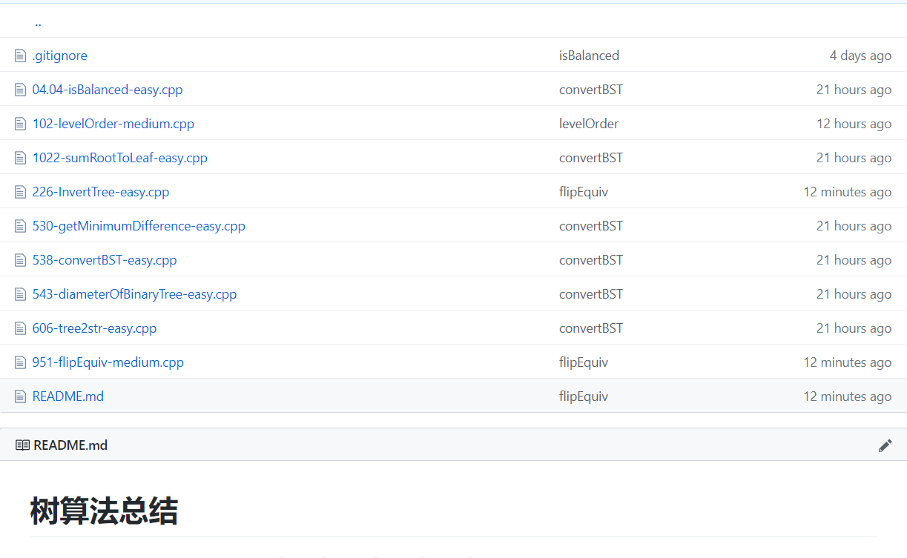

# Leetcode

## Introduction

This is a repository to store my program for Leetcode. 

## How to use?

You can click on to enter a topic you like. Then you can find my summaries of algorithm and corresponding program.

For example, you can click the topic named `Binary Tree` and enter. You will see the following window. 

