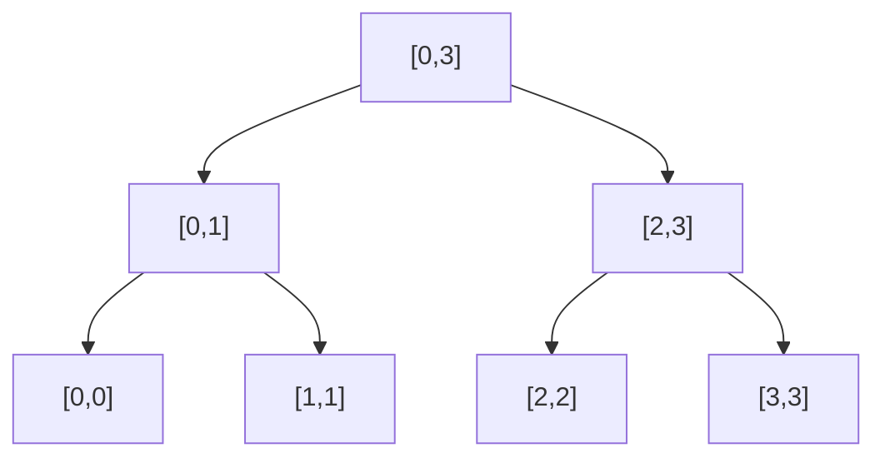

## Description

给定一个整数数组 nums，求出数组从索引 i 到 j  (i ≤ j) 范围内元素的总和，包含 i,  j 两点。

update(i, val) 函数可以通过将下标为 i 的数值更新为 val，从而对数列进行修改。

## Examples

```
Given nums = [1, 3, 5]

sumRange(0, 2) -> 9
update(1, 2)
sumRange(0, 2) -> 8
```

<!--more-->

## Thought

### Segement Tree(线段树)

一颗线段树的构造就是根据区间的性质的来构造的, 如下是一棵区间`[0, 3]`的线段树，每个`[start, end]`都是一个二叉树中的节点。



区间划分大概就是上述的区间划分。可以看出每次都将区间的长度一分为二,数列长度为`n`,所以线段树的高度是`log(n)`,这是很多高效操作的基础。
 上述的区间存储的只是区间的左右边界。我们可以将区间的最大值加入进来,也就是树中的`Node`需要存储`left`，`right`左右子节点外，还需要存储`start`, `end`, `val`区间的范围和区间内表示的值。

**可以储存不同的值，例如区间内的最大值，最小值，区间的求和等等。**

因为每次将区间的长度一分为二,所有创造的节点个数，即底层有`n`个节点，那么倒数第二次约`n/2`个节点，倒数第三次约`n/4`个节点，依次类推：

```
n + 1/2 * n + 1/4 * n + 1/8 * n + ...
=   (1 + 1/2 + 1/4 + 1/8 + ...) * n
=   2n
```

**所以构造线段树的时间复杂度和空间复杂度都为`O(n)`。**

## Solution

```javascript
class segmentTree{
    constructor(start,end,sum){
        this.start = start;
        this.end = end;
        this.sum = sum;
        this.left = this.right = null;
    }
}
var NumArray = function(nums) {
    // console.log(nums.length);
    this.segmentTree = build(0,nums.length-1,nums);
};

var build = function(left,right,array){
    if(left > right){
        return null;
    }

    let root = new segmentTree(left,right,array[left]);
    if(left === right){
        return root;
    }
    let mid = Math.floor((left+right)/2);
    root.left = build(left,mid,array);
    root.right = build(mid+1,right,array);
    root.sum = root.left.sum+root.right.sum;
    return root;
}

NumArray.prototype.update = function(i,val) {
    modify(this.segmentTree,i,val);
};

var modify = function(root,index,value){
    if(root.start == index && root.end == index){
        root.sum = value;
        return;
    }

    let mid = Math.floor((root.start+root.end)/2);
    if(index<=mid){
        modify(root.left,index,value);
    }else{
        modify(root.right,index,value);
    }

    root.sum = root.left.sum+root.right.sum;
}
/** 
 * @param {number} i 
 * @param {number} j
 * @return {number}
 */
NumArray.prototype.sumRange = function(i,j) {
   console.log(this.segmentTree);
   let res = query(this.segmentTree,i,j);
   return res;
};

var query = function(root,start,end){
     if(start == root.start && root.end == end){
        return root.sum;
    }

    let mid = Math.floor((root.start+root.end)/2);
    let leftsum=0;
    let rightsum=0;
    //左子区
    if(mid >= start){
        if(mid<end){
            leftsum = query(root.left,start,mid);
        }else{
            leftsum = query(root.left,start,end);
        }
    }
    //右子区
    if(mid<end){
        if(start <= mid){
            rightsum = query(root.right,mid+1,end);
        }else{
            rightsum = query(root.right,start,end);
        }
    }

    return leftsum+rightsum;
}
```


